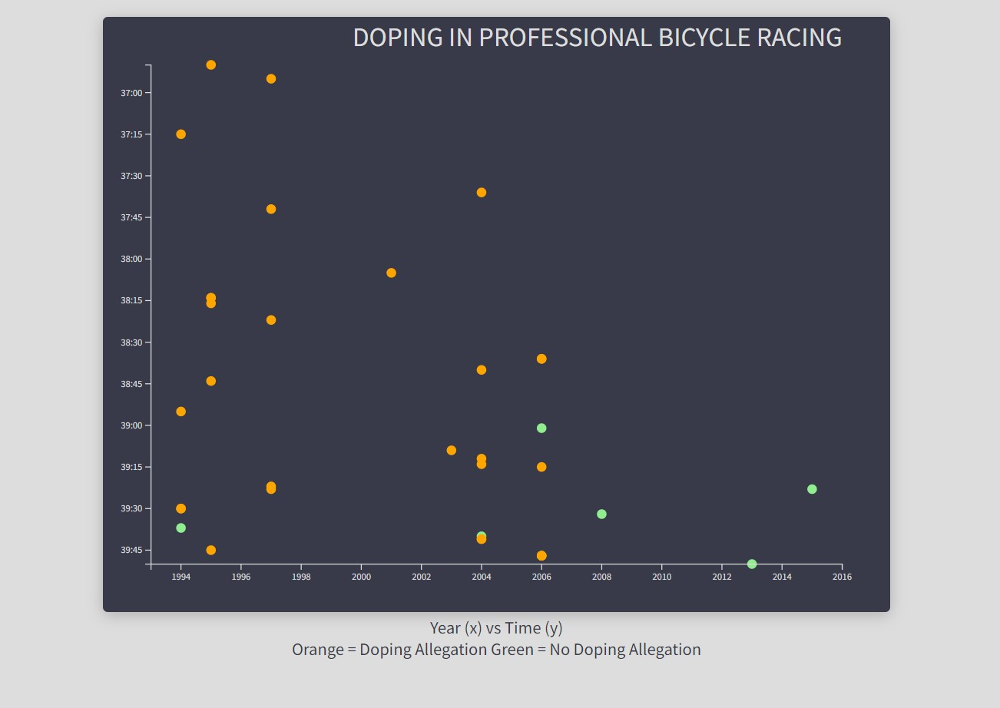

# Scatterplot Graph
This is a scatterplot graph project that displays data about doping in professional bicycle racing. It uses D3.js to visualize the data and allows users to interact with the graph by hovering over data points to see additional information in a tooltip.

## Preview

## Project Description
The scatterplot graph displays the relationship between the year and the time taken by cyclists in a race. Each data point represents a cyclist, and the color of the data point indicates whether there are doping allegations associated with the cyclist.

## Features
- Hover over a data point to display a tooltip with detailed information about the cyclist, including the year, name, time taken, and doping allegations (if any).
- The x-axis represents the year, and the y-axis represents the time taken in minutes and seconds.
- The graph scales dynamically based on the data to fit within the given dimensions.
- Data points are color-coded: orange indicates doping allegations, and green indicates no doping allegations.
- The graph includes axis labels for the x-axis and y-axis.

## Technologies Used
- HTML
- CSS
- JavaScript
- D3.js (Data-Driven Documents)

## Getting Started
1. Clone the repository:

   ```bash
   git clone <repository_url>
2. Open the index.html file in a web browser.

3. Interact with the scatterplot graph by hovering over data points to see the tooltip with detailed information.

## Project Structure
The project structure is as follows:

- `index.html`: The HTML file that contains the structure and elements of the web page.
- `style.css`: The CSS file that defines the styles and layout of the web page.
- `script.js`: The JavaScript file that contains the logic for generating the scatterplot graph using D3.js.

## Contributing
Contributions are welcome! If you encounter any issues or have suggestions for improvements, please feel free to open an issue or submit a pull request.

## Credits
This Scatterplot Graph project is part of the [FreeCodeCamp Data Visualization Certification](https://www.freecodecamp.org/learn/data-visualization/) course. It was completed as one of the required projects in the curriculum.

Special thanks to freeCodeCamp for providing educational resources and coding challenges to help developers learn and improve their skills.

### Resources
- [D3.js](https://d3js.org/): A powerful JavaScript library for creating data visualizations in the browser.
- [freeCodeCamp](https://www.freecodecamp.org/): An open-source community that offers a platform for learning web development through hands-on coding projects.
